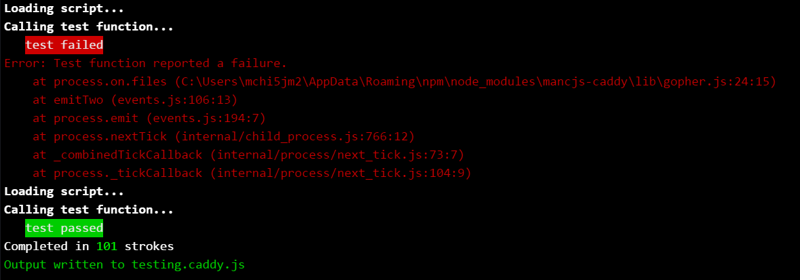

# MancJS Code Golf Caddy
Beat those JS Pros of the [MancJS](https://github.com/mancjs) User Group with the help of this caddy!

Save time with automated testing and building of your solution with a handy score/stroke indicator to boot.

Say No To:
* Constantly commenting and uncommenting console.log statements
* Submitting broken scripts
* Having to wait to check your score

Say Yes To:
* Simple installation:
`npm install -g mancjs-caddy`

* Simple command-line usage:`caddy some-file.js`
  * A boilerplate file is created if some-file.js doesn't exist


* Automated testing and building

  * Specify the `test` function to run when the file changes
  * See the result in the command-line
  * If the test is a success then the `play` function is written out to a .caddy.js file.

```JavaScript
let play = a => (a+'').split``
  .map(
     n=>'zero0one0two0three0four0five0six0seven0eight0nine'
     .split('0')[n])
  .join(' ')

let test = () =>{
  return 'one two three four' === play(1234)
}
```

